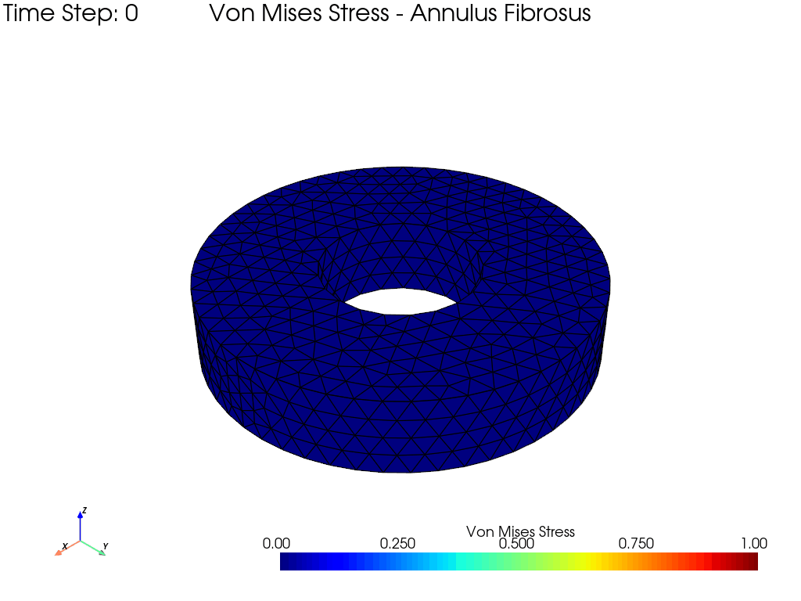
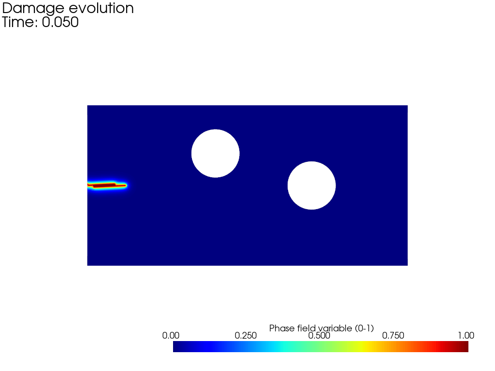
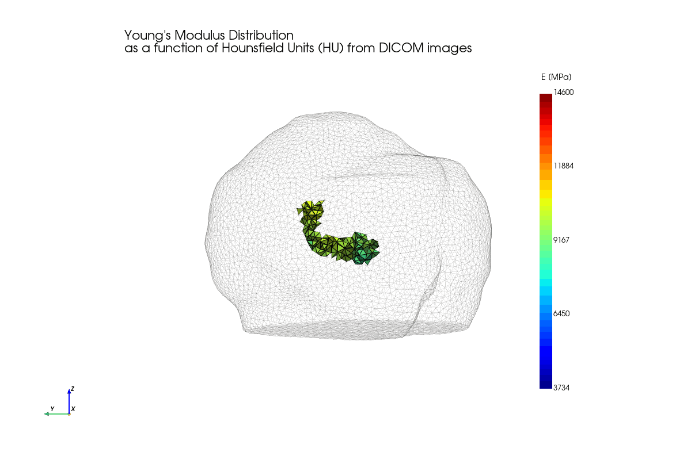
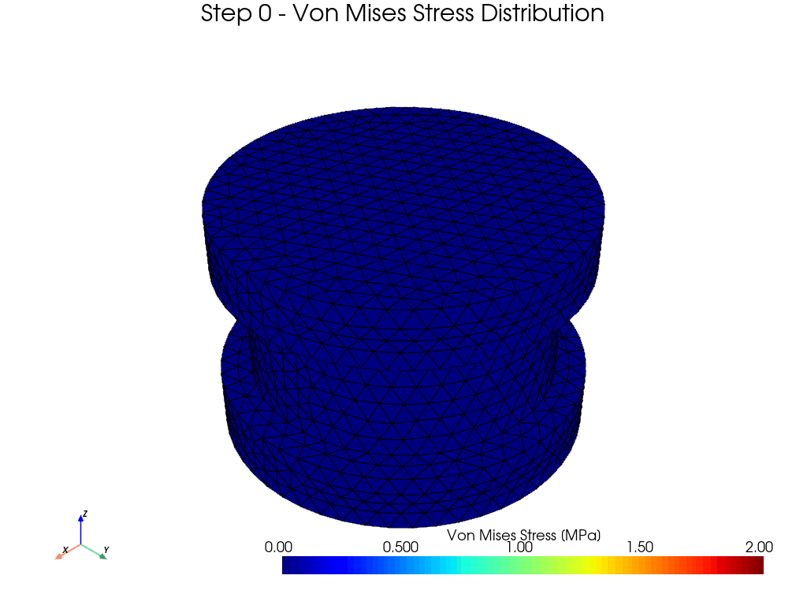
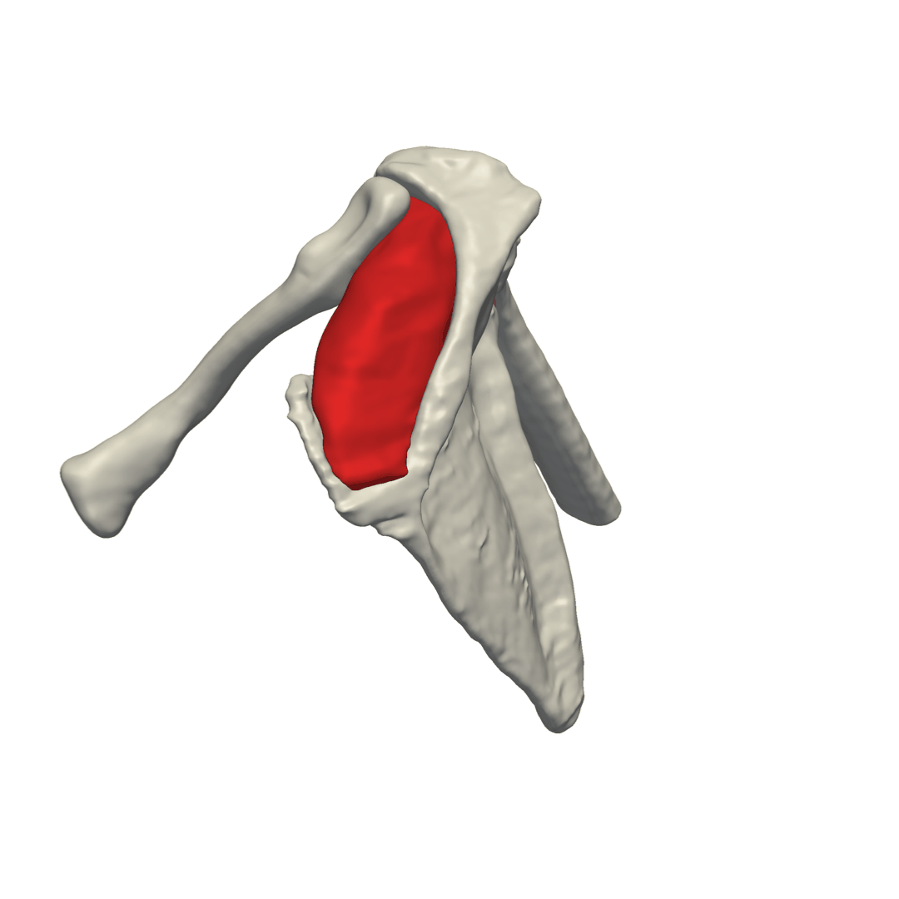

# Recent Works in Computational Mechanics
My recent projects in computational mechanics are carried out using the Python library FEniCSx and the software FEBio.

**Table of Contents:**
1. [**Annulus fibrosus:**](#Annulus-fibrosus)
1. [**Fracture mechanics:**](#Fracture-mechanics)
1. [**Coupling Different Constitutive Models:**](#Coupling-Different-Constitutive-Models)
1. [**Rotator cuff:**](#Rotator-cuff)

## Annulus fibrosus:
One of the first papers I studied at the beginning of my PhD was the work by Eberlein, Holzapfel, and Schulze-Bauer (2001) ([DOI: 10.1080/10255840108908005](https://www.tandfonline.com/doi/abs/10.1080/10255840108908005)), where an anisotropic fibre-reinforced constitutive model for the annulus fibrosus was introduced.

I revisited that work from a computational perspective.

Using the FEniCSx library ([FEniCS Project](https://jsdokken.com/dolfinx-tutorial/index.html#)), I implemented a finite element simulation of the annulus fibrosus under compression, adopting the same constitutive framework to investigate how fibre orientation and anisotropy influence the mechanical response of the intervertebral disc.
For this simulation, I used an idealised geometry; however, the same approach can be extended to patient-specific geometries reconstructed from medical imaging data.

## Fracture mechanics:
I have always been fascinated by fracture mechanics, and recently I finally started exploring it.
Recently, I came across an excellent YouTube course on phase field methods by Professor Emilio Martínez Pañeda, and I could not resist starting it.

I completed the course, explored several fascinating research articles, and started implementing my own simulations using fenicsx ([FEniCS Project](https://jsdokken.com/dolfinx-tutorial/index.html#)). 💻
Here is my very first phase field simulation. ⚙️
A simple example, but an exciting starting point.

I am currently working on the implementation of phase field models in FEniCSx for fracture and crack growth in hard and soft biological tissues, as well as biomedical devices.

In this update, after an intense afternoon of fine-tuning the pipeline, I mapped the heterogeneous Young's Modulus distribution (E) directly onto the humerus mesh. The local stiffness is computed cell-by-cell as a function of the Hounsfield Units (HU) extracted from the original DICOM CT dataset.

(Note: The numerical values of Young's Modulus shown in the GIF legend are preliminary placeholders to test the pipeline and will be updated with literature-validated empirical relations in the next iteration.)

This approach allows us to capture the realistic variation between cortical and trabecular bone, which is fundamental for predicting anchor fixation strength and stress transfer accurately.

By combining HU-based heterogeneous material properties with the phase-field fracture framework, we can build high-fidelity simulations that closely mirror real biomechanical behavior.

## Coupling Different Constitutive Models:
I implemented a 3D finite element simulation of two vertebrae with an annulus fibrosus in between using the ([multifenicsx library](https://github.com/multiphenics/multiphenicsx)).
Here are a few key aspects of the implementation: 
Material modelling: The bone tissue is modelled as linear elastic, while the annulus fibrosus is represented as a fibre-reinforced hyperelastic material to capture its complex anisotropic response. 
Incompressibility: To overcome volumetric locking issues, I used a three-field mixed variational formulation.

Simulating complex biomechanical interactions between hard and soft tissues is essential for advancing spinal biomechanics and optimising surgical implants or medical devices.

This is just the starting point! 🚀
I am currently working on expanding this framework by incorporating patient-specific geometries reconstructed from medical imaging and integrating biodegradable polymeric materials for advanced implant design.

## Rotator cuff:
I am currently developing a computational model specifically designed for Finite Element Analysis (FEA) using FEniCS Project library to evaluate and validate suture anchor techniques in shoulder arthroscopy.
By simulating biomechanical stress, anchor fixation, and suture tension, this FEA framework aims to accelerate the design and testing of novel medical devices for: 
🔹 Rotator Cuff Repair
🔹 Glenoid Labrum Repair

In-silico simulation allows us to assess mechanical performance, optimize anchor geometry, and predict potential failure modes early in the R&D process, reducing reliance on physical testing while increasing reliability.
Stay tuned for updates, visual previews, and insights into the development process! 🛠️💻

I’ve completed the initial simulation run for the shoulder model designed to evaluate suture anchor techniques for rotator cuff repairs numerically. 💻🦴

For this baseline setup, I leveraged the ([dolfinx-contact](https://github.com/Wells-Group/asimov-contact)) library in FEniCSx, implementing a tie-contact formulation to couple the supraspinatus tendon insertion to the bone.
While this initial proof-of-concept uses simplified geometry and tie conditions, it provides a solid foundation for verifying the framework before scaling up complexity.
Next Steps:
🎯 Implementing frictional contact formulations to simulate partial- or full-thickness tear conditions.
🎯 Incorporating collagen fiber orientation within the tendon tissue.

Here is a first look at the Von Mises stress visualisation on both the supraspinatus tendon and the bone. 📊💻
⚠️ A quick note on the current state:
Right now, the material parameters and the traction force applied to the tendon are arbitrary and non-physiological.
At this stage, the primary objective isn't to extract validated biomechanical results yet, but to test and verify that the overall framework I’m building for in-silico medical device testing works seamlessly from end to end. 🛠️

