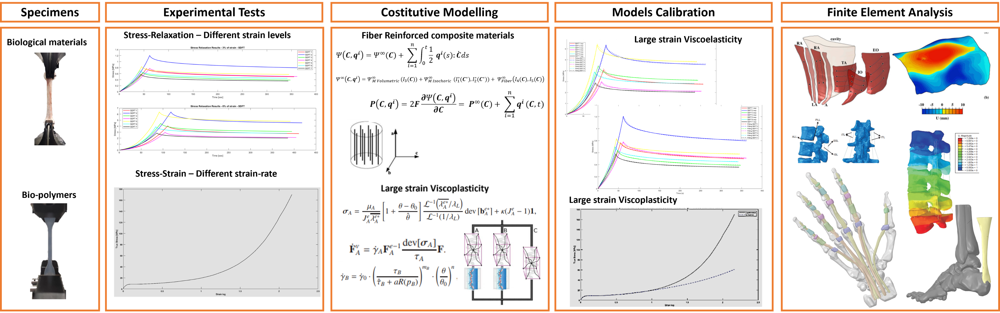
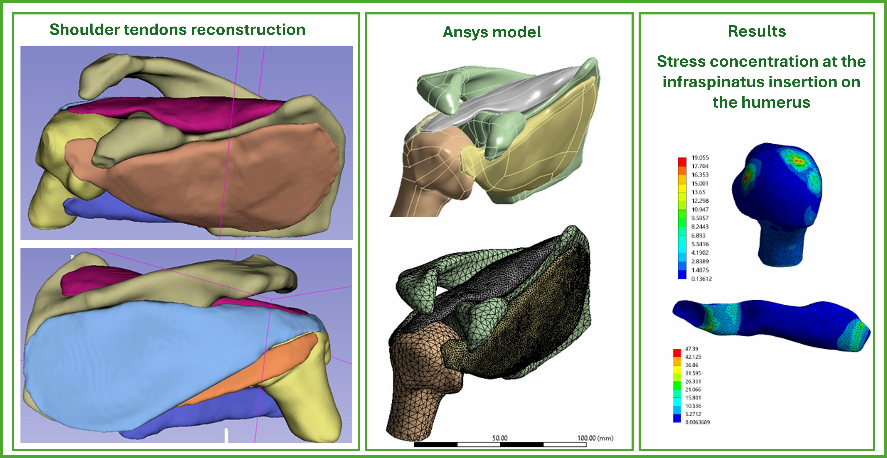
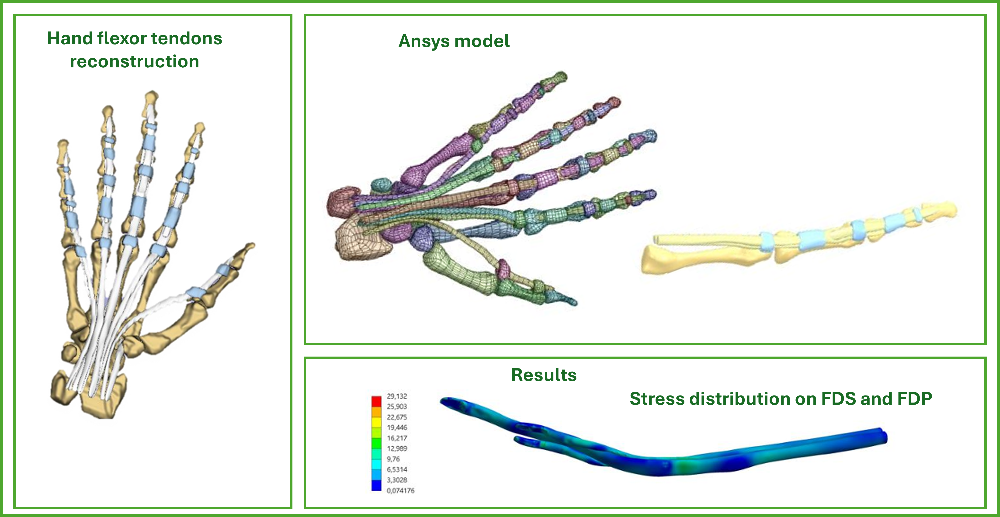
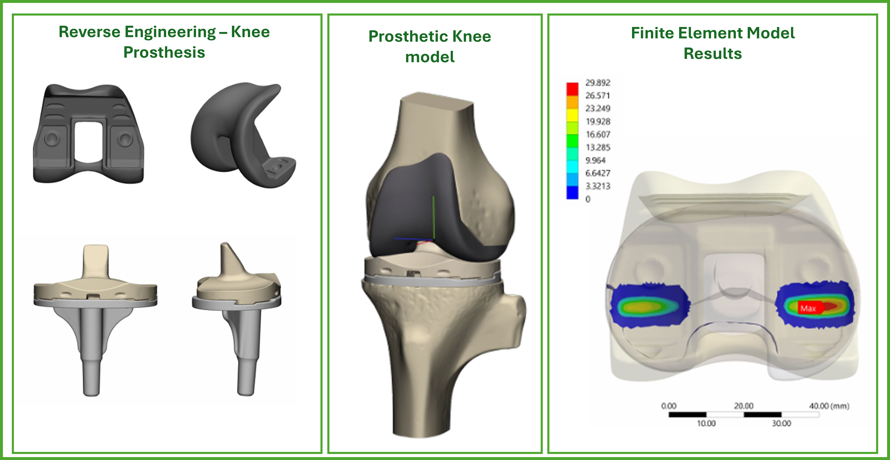
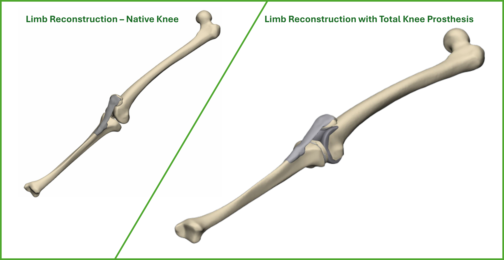
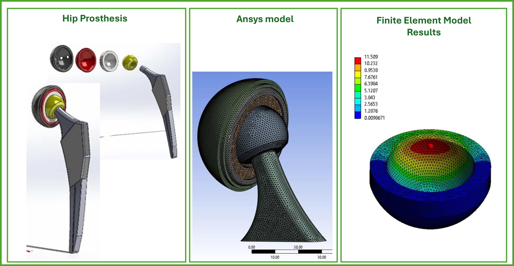
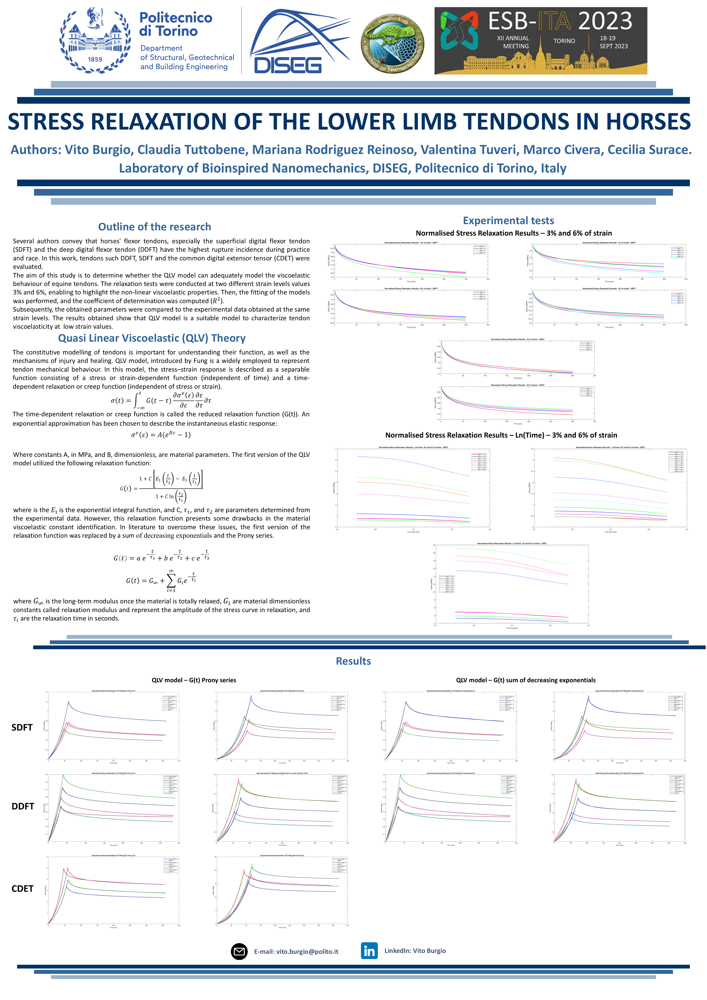
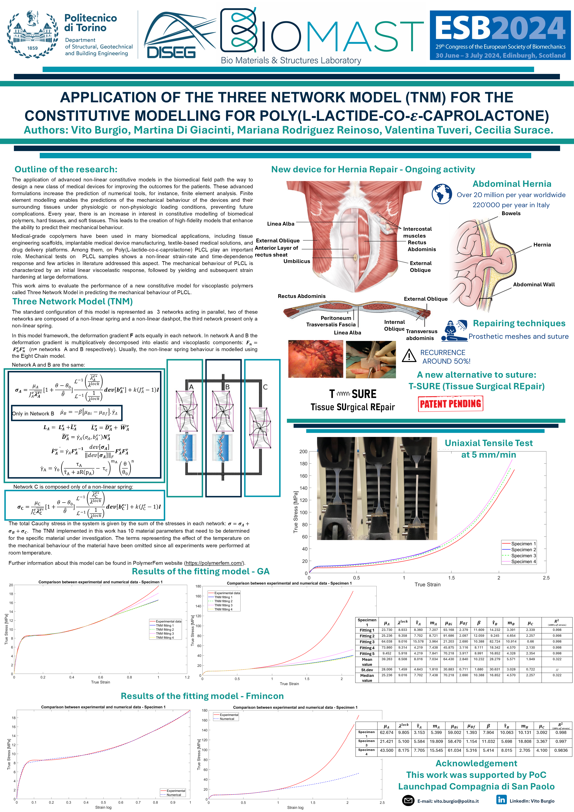
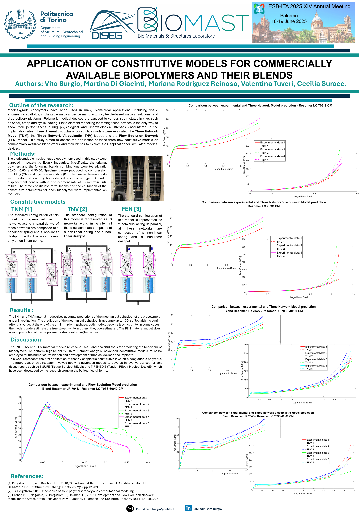

# Curriculum Vitae
Hi, I'm Vito Burgio, a Ph.D. student in *Structural and Solid Mechanics* at Politecnico di Torino.
This repository is a technical portfolio collecting my projects in computational mechanics and numerical modelling, carried out during my academic journey.
 

**Table of Contents:**
1. [**About me:**](#about-me)
1. [**Finite Element Projects:**](#finite-element-projects)
1. [**Work in progress activities:**](#work-in-progress-activities)
1. [**Publications:**](#publications)
    1. [**Journal papers:**](#journal-papers)
    1. [**Conference papers:**](#conference-papers)

## About me:
I'm a Biomedical Engineer specialising in Biomechanics, with a background in experimental testing for material characterisation and constitutive modelling of polymers, as well as soft and hard biological tissues.  
My research focuses on numerical modelling of the mechanical behaviour of materials, and I am constantly working to enhance my skills in Finite Element Analysis (FEA).  
Accurate material modelling requires a comprehensive understanding of its mechanical behaviour, which can only be achieved through experimental testing. Over the years, I have both reviewed the relevant research literature and performed a wide range of experiments to investigate material responses under different conditions.  
Parallel to these activities, I possess advanced skills in CAD and 3D printing.
I have been working at the [**BIOMAST Lab**](https://biomast.polito.it/) (Bio-Materials and Structures) Lab, where my research focuses on developing numerical models of human and animal body parts, enabling in-depth investigations of orthopaedic problems that present challenges in medical treatment and care.  
I am actively involved in the [**T-REMEDIE project**](https://www.eurekaventure.it/portfolio/the-t-rem3die-politecnico-di-torino) (Tendon REpair MEdical DevIcE) project, developed at Politecnico di Torino, which won the Eureka! Proof of Concept (250k) and the Ancalau Award. T-REMEDIE is an innovative biocompatible and biodegradable device for tendon repair.
I am also part of the [**T-SURE project**](https://biomast.polito.it/t-sure/)  (Tissue SUrgical REpair) project, an innovative device for abdominal hernia repair.  

## Finite Element Projects:

## Work in progress activities:

## Publications
A collection of my scientific articles and conference papers related to computational mechanics, finite element modelling, and biomechanics.  
[Research Gate](https://www.researchgate.net/profile/Vito-Burgio-2?ev=hdr_xprf&_tp=eyJjb250ZXh0Ijp7ImZpcnN0UGFnZSI6ImxvZ2luIiwicGFnZSI6InB1YmxpY2F0aW9uIiwicHJldmlvdXNQYWdlIjoicHJvZmlsZSIsInBvc2l0aW9uIjoiZ2xvYmFsSGVhZGVyIn19)

### Journal papers:
1. [Mechanical Characterization and Constitutive Modelling of Commercial Biopolymers and Their Blends for Biomedical Applications](https://www.sciencedirect.com/science/article/pii/S1751616125003212?via%3Dihub)
1. [Mechanical Stapling Devices for Soft Tissue Repair: A Review of Commercially Available Linear, Linear Cutting, and Circular Staplers](https://www.mdpi.com/2076-3417/14/6/2486)
1. [Mechanical properties of animal ligaments: a review and comparative study for the identification of the most suitable human ligament surrogates](https://link.springer.com/article/10.1007/s10237-023-01718-1)
1. [Mechanical Properties of Animal Tendons: A Review and Comparative Study for the Identification of the Most Suitable Human Tendon Surrogates](https://www.mdpi.com/2227-9717/10/3/485)
1. [Effects of Curing on Photosensitive Resins in SLA Additive Manufacturing](https://www.mdpi.com/2673-3161/2/4/55)
1. [Effects of the Manufacturing Methods on the Mechanical Properties of a Medical-Grade Copolymer Poly(L-lactide-co-D,L-lactide) and Poly(L-lactide-co-ε-caprolactone) Blend](https://www.mdpi.com/1996-1944/14/21/6381)
1. [Design and Mechanical Characterization Using Digital Image Correlation of Soft Tissue-Mimicking Polymers](https://www.mdpi.com/2073-4360/14/13/2639)
1. [Analysis of a Motocross Knee Brace: From the Real Model to the Numerical Finite Element Model via 3D Scanning and Reverse Engineering](https://www.mdpi.com/2076-3417/13/8/5186)
1. [Worldwide Incidence and Surgical Costs of Tendon Injuries: A Systematic Review and Meta-Analysis](https://www.mltj.online/worldwide-incidence-and-surgical-costs-of-tendon-injuries-a-systematic-review-and-meta-analysis/)
1. [Implantable medical devices for tendon and ligament repair: a review of patents and commercial products](https://www.tandfonline.com/doi/full/10.1080/17434440.2022.2142557)
1. [3D printing and testing of rose thorns or limpet teeth inspired anchor device for tendon tissue repair](https://actabio.pwr.edu.pl/fcp/aGBUKOQtTKlQhbx08SlkTUARAUWRuHQwFDBoIVURNWH5TFVZpCFghUHcKVigEQUw/302/public/publikacje/v23-4-2021/66.pdf)

### Conference papers:
**European Society of Biomechanics (ESB) - Italian chapter - Torino 2023**  

**European Society of Biomechanics (ESB)  - Edinburgh 2024**

**European Society of Biomechanics (ESB) - Italian chapter - Palermo 2025**
